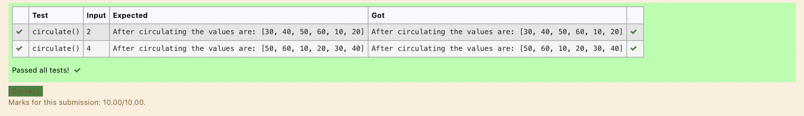

# Circulate-the-values-of-N-variables
## Aim:
To write a python program to circulate the n variables using function concept
## Equipment’s required:
PC
Anaconda - Python 3.7
## Algorithm: 

### Step 1: 
Get the value from the user for the number of rotation
### Step 2: 
Using the slicing concept rotate the list
### Step 3:
Dispaly the output.
### Step 4:
End the program.

## Program:
#Program to circulate N values.

#Developed by: 

#RegisterNumber:

def circulate():

   l=[10,20,30,40,50,60]

   n=int(input())

   result=l[n:]+l[:n]

   print("After circulating the values are:",result)

## Output:

## Result:
Thus the circulate the values of N variables are successfully executed